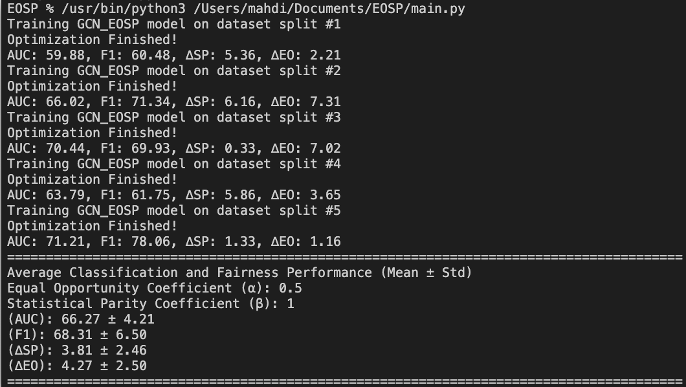

# EOSP
This repository is an official implementation of EOSP in ["Fairness Enhancing Loss for Graph Neural Networks with Incomplete Sensitive Attributes"].

## Configuration
The default Python version used is Python 3.9.18. 
Please install all necessary packages using the following command:

```linux
pip install -r requirements.txt
```

## Run the code
After installation, you can clone this repository
```linux
git clone https://github.com/mtavassoli/EOSP.git
```
```linux
cd EOSP
```
```linux
python main.py --model=GCN_EOSP --dataset=german
```


## Acknowledgement
The code is developed based on the following paper:
```linux
[1] Mahdi Tavassoli Kejani, Fadi Dornaika, and Jean-Michel Loubes. Fairness Enhancing Loss for Graph Neural Networks with Incomplete Sensitive Attributes.
```
